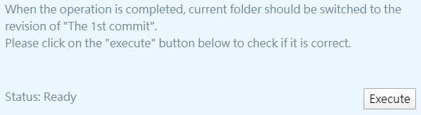

## [[中文說明]](docs/readme/zh-hant.md)

# intergitive -- Learn `git` by using it, with graphical interface!

`intergitive` aims to guide **anyone** who wants to use git to develop projects collaboratively. It teaches using a git [GUI](https://en.wikipedia.org/wiki/Graphical_user_interface) interactively. 

For a gentle guide to how to use it and more details, please refer to the [introduction below](#introduction)  
As for introductions to how to contribute to this project, please refer to the [contribution guides](docs/contribution-guides/en.md)

## Introduction  

[Download link to Windows version](https://github.com/lonelyshore/intergitive/releases)  

### Goal

Have you ever or are you suffered from using git? Are these situations familiar to you?  
- I can read every sigle word in the git document, but I just don't understand what it means when they are put together.
- Followed the steps from the tutorial/Q&A, but the result is different from what they said.
- Blow up my repository accidentally and lost my progress. I needed to spend lots of time to fix it or re-do my work. 
- Online materials such as tutorials or Q&As target the daunting git command line interface. I would really appreciate a tutorial for my beloved git GUI.  

If you have any of the above problems, `intergitive` can help you!  

`intergitive` is designed to help **anyone** who wants to use git to develop projects collaboratively. Here are the features:  
- It comprises of comprehensive explanations and use illustrations to help them easy to understand
  - For example, here is a quote of explanation of "checkout" from the [git official site](https://git-scm.com/docs/git-checkout):
  ```
    Updates files in the working tree to match the version in the index or the specified tree. If no pathspec was given, git checkout will also update HEAD to set the specified branch as the current branch.
  ```
  - And here is how `intergitive` says about the same thing
      
- `intergitive` explains working mechanism and concepts of git in addition to instructions of how to operate it
- It guides a user with an interactive "operate-and-verify" mechanism to ensures a user stays on track and has a great sense of progression
  - For example, teaching a three-steps operation in a statical tutorial may look like:
    - The tutorial lists all the steps
    - The reader follows them one by one
    - The tutorial may provide the expected result of the operation
    - The reader can compare his/her own result against the expected one. However, even if the reader knows the result is wrong, he/she would have no idea of what went wrong...🙈
  - In `intergitive`, the process is like:  
    - It shows how to do the first step, the reader follows.
    - When the reader completes, he/she triggers `intergitive` to check if the result is as expected, as shown below
      
      - If the result is as expected, the reader may continue on.
        
      - On the other hand, the reader knows the last step was incorrect, reverts it back, and tries again.
        
    - The reader continues until reaching the goal 🏁  
- A reader learns how to use a friendly git GUI instead of the formidable CLI. Currently `intergitive` supports:  
  - [fork](https://git-fork.com/)(English version is WIP)
  - [Git Extensions](http://gitextensions.github.io/)(WIP)

### Installation and Execution

- Download the `intergitve` bundle from the link listed above.  
- Uncompress the zip file. Choose a directory to put the extracted folder.  
  - Because of technical limitation, please avoid locating it in a directory that is monitored by git.
  - If you are unsured about what "monitored by git" means, you probably do not need to worry about it. Please choose any folder you would like to.
- Open the extracted folder after uncompression is completed. There should be a executable file named `intergitive.exe` inside it.  
- To launch `intergitive`, execute the executable.  

### Outline of Content

Currently `intergitive` covers the following topics/concepts:  
- Commit
  - What is it?
  - How it can be used? 
- Branch
  - What is it?
  - How to create/merge/delete one?
  - How to use it to develop a project concurrently?
- Repository
  - What does it contain?
  - How to create/clone it?
  - How do local and remote repositories communicate?
  - How to use local/remote repository model to develop a project collaboratively?


### Comparisons to Related Works  

Here is a list of some of the other well-known git tutorials.
One may select the best suited tutorial here：  

- [Git-it (Desktop App)](https://github.com/jlord/git-it-electron)
  - Teaches how to use git basic commands step-by-step and how to use [GitHub](https://github.com/). Intergitive is inspired by it.
  - Suitable for
    - who wants to get familiar with git command line in a short time. Not planning to use a GUI.
    - who wants to learn how to use GitHub for project development.
- [Learn Git Branching](https://learngitbranching.js.org/?locale=en_US)
  - Focuses on how to manipulate branches in git. It teaches related git commands interactively. Intergitive is inspired by it.
  - Suitable for
    - who is already familiar with git operation and would like to learn advanced techniques to manipulate branches efficiently.
    - who wants to take challengs of manipulating branches in least steps.
- [git official tuturial](https://git-scm.com/book/en/v2)
  - The tutorial written by the community. Covers all sorts of commands and very detailed internal concepts of git.
  - Suitable for
    - who wants to learn how to use git CLI
    - who is already familiar with git operation and would like to know more about mechanisms of git
    - who wants to get hands on plumbing or rarely used commands
- [Understanding Git (part 1) — Explain it Like I’m Five](https://hackernoon.com/understanding-git-fcffd87c15a3)
  - Introduces frequently used commands of git in simple words
  - Suitable for
    - who wants to briefly learns git commands
- [Visual git guide](https://marklodato.github.io/visual-git-guide/index-en.html)
  - Visualize several important operations
  - Suitable for
    - who wants to get a sense about the effects of each git commands
    - who is already familiar with git, but want to review/ensure the actually effect of each command
- [Git parable](https://tom.preston-werner.com/2009/05/19/the-git-parable.html)
  - Introduces the process of how a VCS could be developed from scratch so a reader can understand how git is structured through the process
  - Suitable for
    - git newbie. This article helps learner builds a concrete foundation of how git works.
    - who is already familiar with git, but wants to know its internal concepts.

### References/Recommended Articles
- [Why the Heck is Git so Hard?  The Places Model™](http://merrigrove.blogspot.tw/2014/02/why-heck-is-git-so-hard-places-model-ok.html)
  - Points out that git is difficult to learn because it has five places to store a snapshot (the places model coined by this article).
- [10 things I hate about Git](https://stevebennett.me/2012/02/24/10-things-i-hate-about-git)
  - Lists the ten reasons why the author hates git. Some of them are: bad user interface, obscure document, complex workflow, incomplete encapsulation, complicated concept
- [The Hardest Things About Learning Git](https://blog.axosoft.com/hardest-things-learning-git/)
  - Opinions of why git is hard to learn, collected from twitter.
- [On undoing, fixing, or removing commits in git]((https://sethrobertson.github.io/GitFixUm/fixup.html)
  - An interesting text-based RPG that guides one to fix a corrupted/unwanted commit