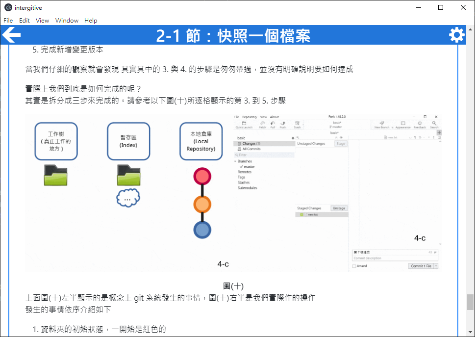

# intergitive -- Learn `git` by using it, with graphical interface!

  

`intergitive` 是一款互動式的 [git](https://git-scm.com/) [圖形化介面](https://zh.wikipedia.org/wiki/%E5%9B%BE%E5%BD%A2%E7%94%A8%E6%88%B7%E7%95%8C%E9%9D%A2)教學軟體。  
它將逐步指引使用者實際操作 git 的介面，並且即時檢驗操作的正確性來讓學習的過程更有趣並富有成就感。  
關於如何使用，請見下方[說明](#中文介紹)  
關於如何幫助這個專案變得更好，請見[開發說明](contribution-guides/zh-TW.md)  

`intergitive` is a program that teaches how to use a [git](https://git-scm.com/) [GUI](https://en.wikipedia.org/wiki/Graphical_user_interface) interactively. It guides a user how to operate the GUI step-by-step and verifies the results immediately. Such an interactive mechanism aims to make learning git interesting.  
For a gentle guide to how to use it and more details, please refer to the [English introduction below](#english-introduction)  
As for introductions to how to contribute to this project, please refer to the [contribution guides](contribution-guides/en.md)

## 中文介紹

[Windows 本體程式下載連結](https://github.com/lonelyshore/intergitive/releases)

### 目標

曾經或正在因為要使用 git 而感到痛苦嗎？  
- 說明文件上的每一個字都看得懂，合成一句話之後就是不知道它在說甚麼！  
- 明明都按照查到的教學/問答集說的做了，可是效果卻完全不一樣？？？  
- 一不小心就把之前做好的東西搞壞了，要把它修好或重做一份又花了一堆時間，到底要 git 做甚麼...  
- 教學或問答大部分都是針對 git 那令人望而生畏的文字指令介面編寫，好想要有針對圖形介面編撰的參考資料！  

如果你有以上的困擾， `intergitive` 將可以幫助你克服這些問題！  

`intergitive` 為**任何**想要以 git 進行共同開發的人設計  
它以淺顯易懂、圖文並茂的內容，逐步介紹 git 共同開發所涉及的操作步驟還有釐清基礎概念  
配合互動式的操作與驗證機制，除了確保姿勢正確更會有逐步解鎖關卡前進的進程感  
更棒的是，使用者將可以用熟悉的圖形介面工具來學習它，不用面對可怕的文字指令介面  
使用者將會真正了解 git 的運作原理，而且而可以觸類旁通地使用這個工具  

### 安裝與執行  

- 請從上方的連結下載 `intergitive`   
- 請使用任何可以解壓縮 zip 的程式來解壓縮它到任意的位置下  
  - 請注意，因為設計上的限制，請勿將它解壓縮到受 git 管控的目錄下  
  - 如果您並不清楚「受 git 管控」的意思，通常這表示您不必擔心這個問題，請任意選擇喜歡的目標位置即可  
- 解壓縮完成之後，請開啟解壓縮的目錄，目錄中會有名為 `intergitive.exe` 的執行檔  
- 請執行這個檔案，就可以開啟 `intergitive`  

### 教學內容  

目前 `intergitive` 涵蓋了以下的課題：  
- commit 是甚麼、commit 的效用、如何製作 commit  
- 分支是甚麼、分支的建立/合併/刪除  
- 分支的效用：通常我們會怎磨使用分支來平行化開發  
- git repository 儲存了甚麼、如何建立/複製 repository、遠端/本地 repository 要如何互動來共同開發  

### 與其它教學的比較  

這裡列出了其它知名的 git 教學材料  
方便您選取適合自己的學習方式：  

- [Git-it (Desktop App)](https://github.com/jlord/git-it-electron)
  - 逐步介紹如何操作 git 指令列以及使用 [GitHub](https://github.com/) 的教學軟體。intergitive 受其啟發  
  - 適合：
    - 想要短時間內概略接觸 git 指令的人，不是很在意圖形化使用介面
    - 想要了解如何使用 GitHub 進行專案開發的人
- [Learn Git Branching](https://learngitbranching.js.org/?locale=zh_TW)
  - 專注於使用 git 命令列進行 git 分支操作的互動式教學軟體。intergitive 受其啟發
  - 適合：
    - 已經熟悉 git 基礎操作的人，想要進一步了解各種分支操作的奇技淫巧
    - 其中有關於分支操作的挑戰關卡，適合精益求精追求以最簡約的 git 指令達成目標的人

## English Introduction  

[Download link to Windows version](https://github.com/lonelyshore/intergitive/releases)  

### Goal

Have you ever or are you suffered from using git? Are these situations familiar to you?  
- I can read every sigle word in the git document, but I just don't understand what it means when they are put together.
- Followed the steps from the tutorial/Q&A, but the result is different from what they said.
- Blow up my repository accidentally and lost my progress. I needed to spend lots of time to fix it or re-do my work. 
- Online materials such as tutorials or Q&As target the daunting git command line interface. I would really appreciate a tutorial for my beloved git GUI.  

If you have any of the above problems, `intergitive` can help you!  

`intergitive` is designed to guide **anyone** who wants to use git to develop projects collaboratively. It introduces how to use git to collaborate with others, and elaborates concepts with comprehensive explanations and illustrations. In addition, its detailed instructions of how to operate git GUI and immediate verification ensures a user stays on track and has a great sense of progression.  
After learning from these elaborations, a user would clearly understand how git truly works and have a full control over it.  

### Installation and Execution

- Download the `intergitve` bundle from the link listed above.  
- Uncompress the zip file. Choose a directory to put the extracted folder.  
  - Because of technical limitation, please avoid locating it in a directory that is monitored by git.
  - If you are unsured about what "monitored by git" means, you probably do not need to worry about it. Please choose any folder you would like to.
- Open the extracted folder after uncompression is completed. There should be a executable file named `intergitive.exe` inside it.  
- To launch `intergitive`, execute the executable.  

### Outline of Content

Currently `intergitive` covers the following topics/concepts:  
- Commit
  - What is it?
  - How it can be used? 
- Branch
  - What is it?
  - How to create/merge/delete one?
  - How to use it to develop a project concurrently?
- Repository
  - What does it contain?
  - How to create/clone it?
  - How do local and remote repositories communicate?
  - How to use local/remote repository model to develop a project collaboratively?

### Comparisons to Related Works  

Here is a list of some of the other well-known git tutorials.
One may select the best suited tutorial here：  

- [Git-it (Desktop App)](https://github.com/jlord/git-it-electron)
  - Teaches how to use git basic commands step-by-step and how to use [GitHub](https://github.com/). Intergitive is inspired by it.
  - Suiltable for
    - who wants to get familiar with git command line in a short time. Not planning to use a GUI.
    - who wants to learn how to use GitHub for project development.
- [Learn Git Branching](https://learngitbranching.js.org/?locale=zh_TW)
  - Focuses on how to manipulate branches in git. It teaches related git commands interactively. Intergitive is inspired by it.
  - Suiltable for
    - who is already familiar with git operation and would like to learn advanced techniques to manipulate branches efficiently.
    - who wants to take challengs of manipulating branches in least steps.
