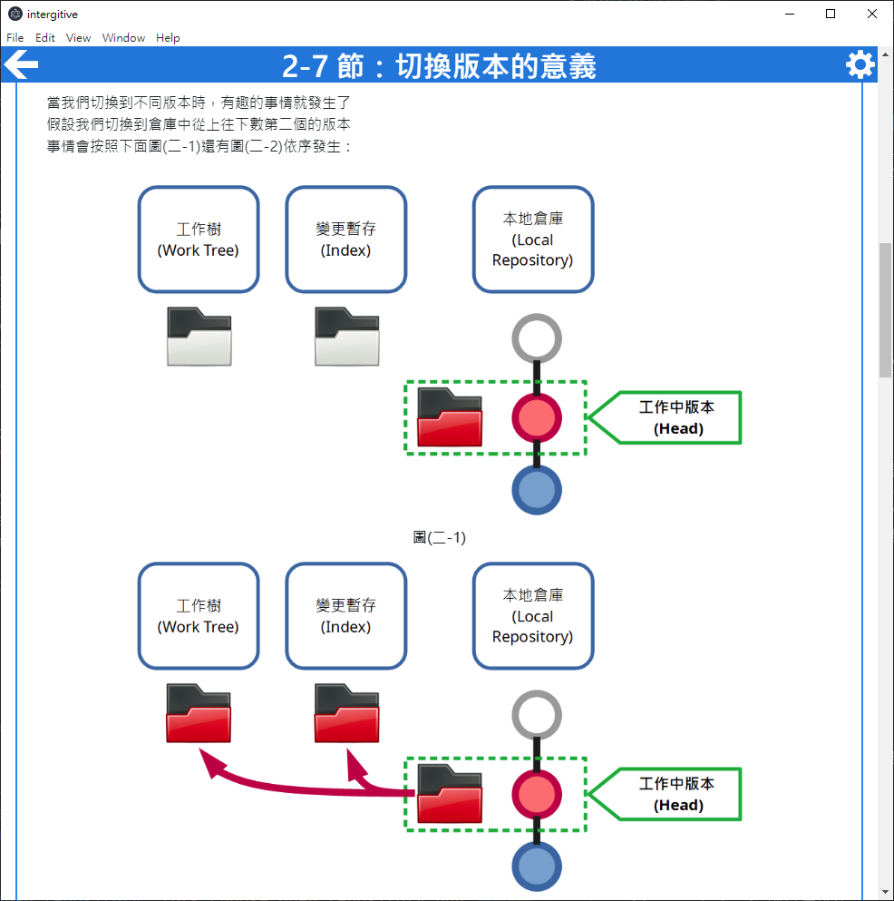

# intergitive -- 透過實際操作學習使用 git，避開嚇人的文字介面，使用簡明易懂的圖形化介面吧！

`intergitive` 為**任何**想要學習 [git](https://git-scm.com/) 設計  
是一款互動式的 git [圖形化介面](https://zh.wikipedia.org/wiki/%E5%9B%BE%E5%BD%A2%E7%94%A8%E6%88%B7%E7%95%8C%E9%9D%A2)教學軟體。  

關於如何使用，請見下方[說明](#簡介)  
關於如何幫助這個專案變得更好，請見[開發說明](../contribution-guides/zh-hant.md)

## 簡介

[Windows 本體程式下載連結](https://github.com/lonelyshore/intergitive/releases)  

### 目標

曾經或正在因為要使用 git 而感到痛苦嗎？  
- 說明文件上的每一個字都看得懂，合成一句話之後就是不知道它在說甚麼！  
- 明明都按照查到的教學/問答集說的做了，可是效果卻完全不一樣？？？  
- 一不小心就把之前做好的東西搞壞了，要把它修好或重做一份又花了一堆時間，到底要 git 做甚麼...  
- 教學或問答大部分都是針對嚇人的 git 文字指令介面編寫，好想要有針對圖形介面編撰的參考資料！  

如果你有以上的困擾， `intergitive` 將可以幫助你克服這些問題！  

`intergitive` 的目標是幫助**任何人**都能學會以 git 進行共同開發  
他有以下的特點：  
- 教學內容淺顯易懂、圖文並茂
  - 例如關於 checkout (切換版本) [git 官方的說明](https://git-scm.com/docs/git-checkout)是這樣的  
    ```
    Updates files in the working tree to match the version in the index or the specified tree. If no pathspec was given, git checkout will also update HEAD to set the specified branch as the current branch.
    ```
  - `intergitive` 則是這樣的  
      
    有圖為例，是不是清楚多了呢？  
- 除了指引操作步驟，還會釐清基礎概念，知其然更知其所以然
  - 了解 git 這個工具的運作原理後，可以觸類旁通地使用它，遇到沒有在教學提過的問題也可以找到解決的方法
- 內建互動式的「操作與驗證」機制，除了確保姿勢正確更會有逐步解鎖關卡前進的進程感  
  - 例如非互動式的教學，教一個涉及三個步驟的操作，大概像這樣：  
    - 教學中條列三個步驟分別是甚麼
    - 讀者一一照做
    - 教學列出成功的話會看到甚麼結果
    - 讀者比對自己看到的畫面，但就算不一致，也不知道哪裡錯了...🙈
  - `intergitive` 的情況，則會是像這樣的流程  
    - 指引第一個步驟如何操作，等待使用者操作  
    - 使用者操作完成，回到 `intergitive`，程式將會確認結果是否符合預期，例如下圖  
      
      - 如果符合預期，就繼續第二個步驟  
        
      - 否則，使用者知道操作錯誤，可以退回上一步重新嘗試  
        
    - 如此反覆，一步一步完成目標 🏁  
- 使用者將用熟悉的圖形介面工具來學習它，不用面對可怕的文字指令介面，支援的工具有  
  - [fork](https://git-fork.com/)
  - [Git Extensions](http://gitextensions.github.io/)(製作中)  

### 安裝與執行  

- 請從以下連結下載 `intergitive`   
  - [Windows 本體程式下載連結](https://github.com/lonelyshore/intergitive/releases)
- 請使用任何可以解壓縮 zip 的程式來解壓縮它到任意的位置下  
  - 請注意，因為設計上的限制，請勿將它解壓縮到受 git 管控的目錄下  
  - 如果您並不清楚「受 git 管控」的意思，通常這表示您不必擔心這個問題，請任意選擇喜歡的目標位置即可  
- 解壓縮完成之後，請開啟解壓縮的目錄，目錄中會有名為 `intergitive.exe` 的執行檔  
- 請執行這個檔案，就可以開啟 `intergitive`  

### 教學內容  

目前 `intergitive` 涵蓋了以下的課題：  
- commit 是甚麼、commit 的效用、如何製作 commit  
- 分支是甚麼、分支的建立/合併/刪除  
- 分支的效用：通常我們會怎磨使用分支來平行化開發  
- git repository 儲存了甚麼、如何建立/複製 repository、遠端/本地 repository 要如何互動來共同開發  

### 與其它教學的比較  

這裡列出了其它知名的 git 教學材料  
方便您選取適合自己的學習方式：  

- [Git-it (Desktop App)](https://github.com/jlord/git-it-electron)(有中文版)
  - 逐步介紹如何操作 git 指令列以及使用 [GitHub](https://github.com/) 的教學軟體。intergitive 受其啟發  
  - 適合：
    - 想要短時間內概略接觸 git 指令的人，不是很在意圖形化使用介面
    - 想要了解如何使用 GitHub 進行專案開發的人
- [Learn Git Branching](https://learngitbranching.js.org/?locale=zh_TW)(中文)
  - 專注於使用 git 命令列進行 git 分支操作的互動式教學軟體。intergitive 受其啟發
  - 適合：
    - 已經熟悉 git 基礎操作的人，想要進一步了解各種分支操作的奇技淫巧
    - 其中有關於分支操作的挑戰關卡，適合精益求精追求以最簡約的 git 指令達成目標的人
- [為你自己學 Git](https://gitbook.tw/)(中文)
  - 深入淺出的 Git 教學，教您使用 Git 指令及圖形介面工具，使用 GitHub 與其它人一起工作
  - 適合：
    - 已經熟悉 git 基礎操作的人，想要進一步了解 git 運作原理的人
    - 想要了解如何使用 GitHub 進行專案開發的人
- [git 官方教學](https://git-scm.com/book/zh-tw/v2)(中文)
  - 開發者社群的人撰寫的 git 教學，詳盡地解說 git 的概念以及各種指令操作
  - 同時亦是本教學中文名詞翻譯的參考範本
  - 適合：
    - 想要學習 git 文字介面如何使用的人
    - 已經熟悉 git 基礎操作的人，想要深入了解 git 的工作原理
    - 想要了解 git 較為冷僻的功能的人
- [Understanding Git (part 1) — Explain it Like I’m Five](https://hackernoon.com/understanding-git-fcffd87c15a3)(英文)
  - 用簡單字彙介紹 git 各種常用指令
  - 適合：想要短時間內概略接觸 git 指令，不是很在意圖形化使用介面的人
- [圖解 git](http://marklodato.github.io/visual-git-guide/index-zh-tw.html)(中文)
  - 將幾個重要操作用圖像化呈現
  - 適合：
    - 想要快速了解 git 文字指令的效果的人
    - 大致熟悉 git ，實際使用的時候想要複習一下不同的指令的效果
- [git 寓言](https://lonelyshore.medium.com/git-%E5%AF%93%E8%A8%80-git-%E6%98%AF%E6%80%8E%E9%BA%BC%E9%95%B7%E6%88%90%E9%80%99%E5%80%8B%E5%BD%A2%E7%8B%80%E7%9A%84-1-105423f5fcfc)(中文翻譯)
  - 以寓言的方式設想 git 從無到有的誕生過程，令讀者了解 git 的大致結構與運作原理
  - [原文連結](https://tom.preston-werner.com/2009/05/19/the-git-parable.html)
  - 適合：
    - 想要學習 git 的新手，可以透過這個文章建立基礎，對於學習實際操作事半功倍
    - 已經熟悉 git 基礎操作的人，想要深入了解 git 的工作原理

### 參考資料/推薦文章
- [Why the Heck is Git so Hard?  The Places Model™](http://merrigrove.blogspot.tw/2014/02/why-heck-is-git-so-hard-places-model-ok.html)(英文)
  - 點出 git 特有的五個存放資料的階段所構築成的「存放點模型(places model)」是造成初學者困惑的原因之一，並列舉其它 git 重要的概念模型
- [10 things I hate about Git](https://stevebennett.me/2012/02/24/10-things-i-hate-about-git)(英文)
  - 提出十點(作者)個人討厭 git 的理由。主要可以歸納為使用者介面設計不良、文件晦澀、操作流程繁瑣、封裝不全、核心概念複雜
- [The Hardest Things About Learning Git](https://blog.axosoft.com/hardest-things-learning-git/)(英文)
  - 從 twitter 收集來的五點 git 難以學習的部分，包含：本地與遠端倉庫的困惑、reset 的三種型態、rebase 的意涵、合併衝突
- [On undoing, fixing, or removing commits in git]((https://sethrobertson.github.io/GitFixUm/fixup.html)(英文)
  - 
